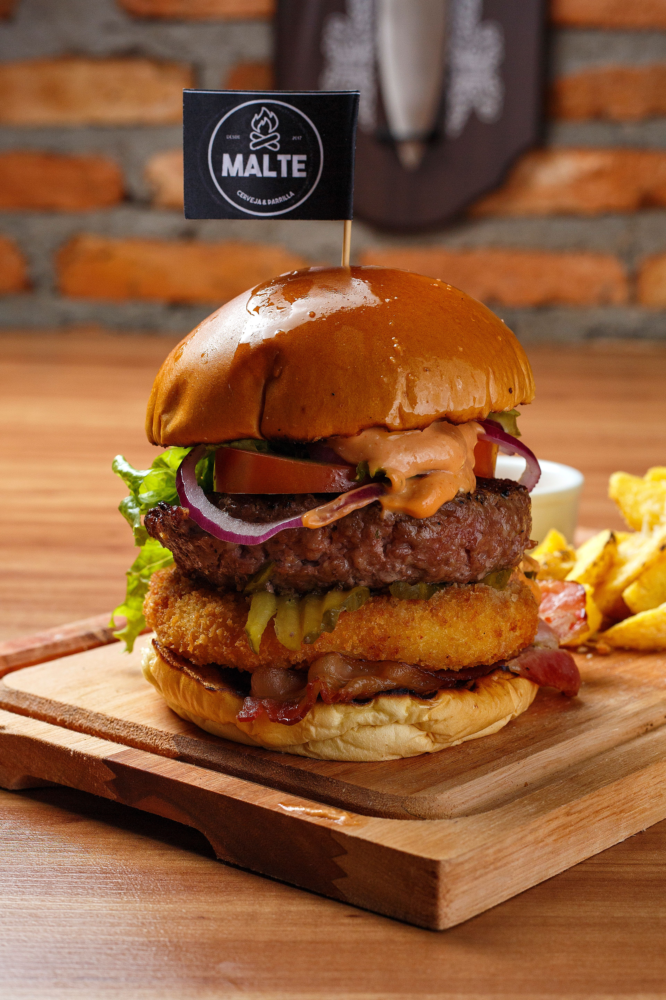

# Burger House - Beginner Guide

This project has **four pages**:

- `index.html` - Home / landing page
- `menu.html` - Burger menu
- `about.html` - About the imaginary company
- `contact.html` - Contact information and a demo form
- `style.css` - Shared styling for all four pages
- `images/` - Burger images used by the pages

## 1. How the pages are connected

Every page uses the same navigation links:

```html
<nav class="nav-links">
    <a href="index.html">Home</a>
    <a href="menu.html">Menu</a>
    <a href="about.html">About</a>
    <a href="contact.html">Contact</a>
</nav>
```

The `href` tells the browser which HTML file to open.

## 2. Why there is only one CSS file

Every page contains:

```html
<link rel="stylesheet" href="style.css">
```

That means the same colors, fonts, navigation and footer styles are reused on all pages.
This keeps the website visually consistent and makes it easier to maintain.

## 3. How Flexbox is used

Flexbox is used for the main layouts, for example:

```css
.hero {
    display: flex;
    align-items: center;
    gap: 60px;
}
```

This puts the hero text and hero image next to each other on a large screen.
Inside the media query, the direction changes:

```css
.hero {
    flex-direction: column;
}
```

Now the text and image stack vertically on smaller screens.

## 4. How the CSS-only burger menu works

The assignment does not allow JavaScript, so the mobile menu uses a checkbox.

HTML:

```html
<input type="checkbox" id="menu-toggle">
<label class="menu-icon" for="menu-toggle">...</label>
```

CSS:

```css
#menu-toggle:checked ~ .nav-links {
    display: flex;
}
```

When the label is clicked, it checks or unchecks the hidden checkbox.
If it is checked, CSS shows the navigation links.

## 5. How responsive design works

The CSS has media queries for smaller screens:

```css
@media (max-width: 768px) {
    /* tablet and mobile changes */
}

@media (max-width: 500px) {
    /* smaller mobile changes */
}
```

The layout should be tested around:

- 375px - mobile
- 768px - tablet
- 1200px or wider - desktop

## 6. How the responsive hero image works

The home page uses `<picture>`:

```html
<picture class="hero-image">
    <source media="(max-width: 600px)" srcset="images/burger-small.jpg">
    
</picture>
```

A smaller image can be loaded on small screens, while the larger image is used on bigger screens.
This is suitable for the large hero image because it can save bandwidth on a phone.

All other images also use:

```css
img {
    max-width: 100%;
    height: auto;
}
```

This stops them from stretching outside their containers.

## 7. Important assignment rules followed

- Semantic HTML is used: `header`, `nav`, `main`, `section`, `article`, `footer`, `form`.
- Vanilla CSS only.
- External stylesheet used.
- Flexbox used for layouts.
- Media queries used.
- Roboto font imported.
- Shared navigation and footer used.
- CSS-only burger menu used.
- No JavaScript.
- No CSS Grid.

## 8. About the contact form

The form is only a front-end demonstration. It does not actually send a message anywhere.
That is intentional because this assignment is about HTML and CSS, not a back-end server.

## 9. What to understand before submitting

Be able to explain these parts in your own words:

1. Why all pages link to the same `style.css` file.
2. What `display: flex` does.
3. What a media query does.
4. How the checkbox makes the CSS-only burger menu work.
5. Why `<picture>` is used for the hero image.
6. Why `max-width: 100%` helps images stay responsive.

Do not only memorize the code. Open the pages, resize the browser, and change small values so you can see what each part does.
